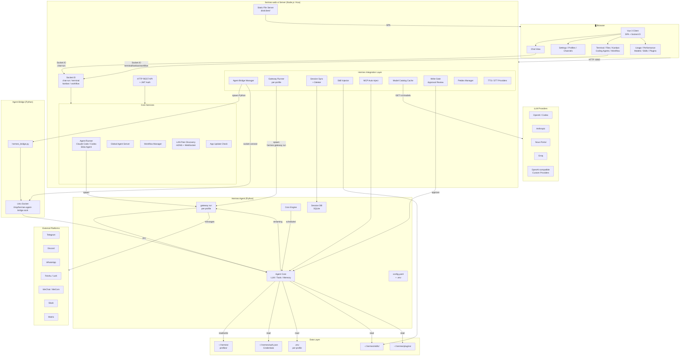
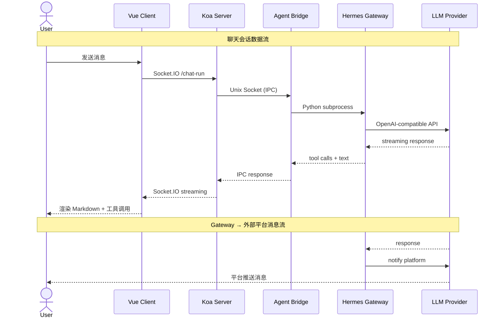
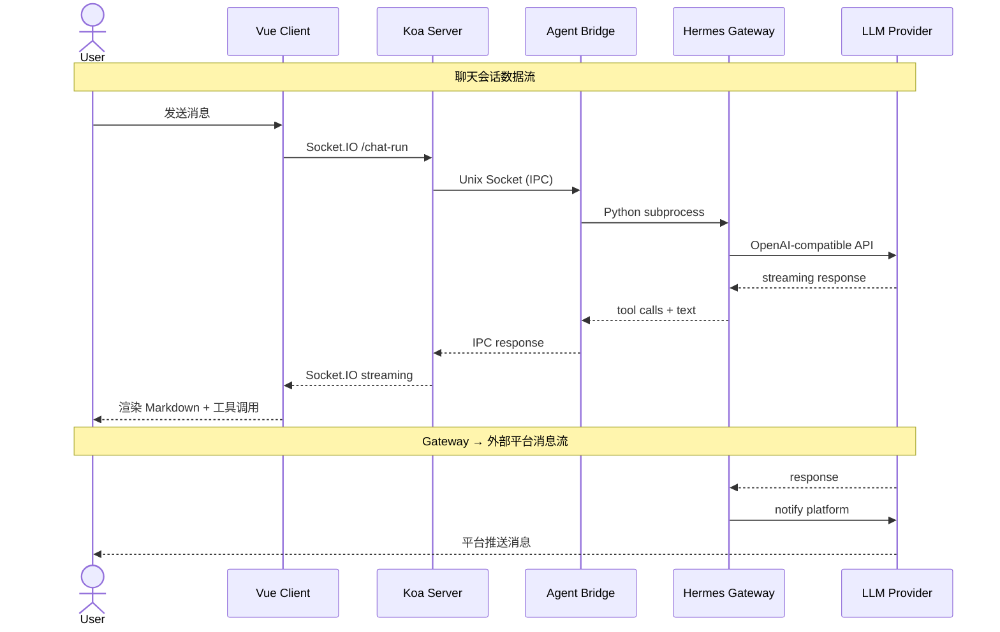
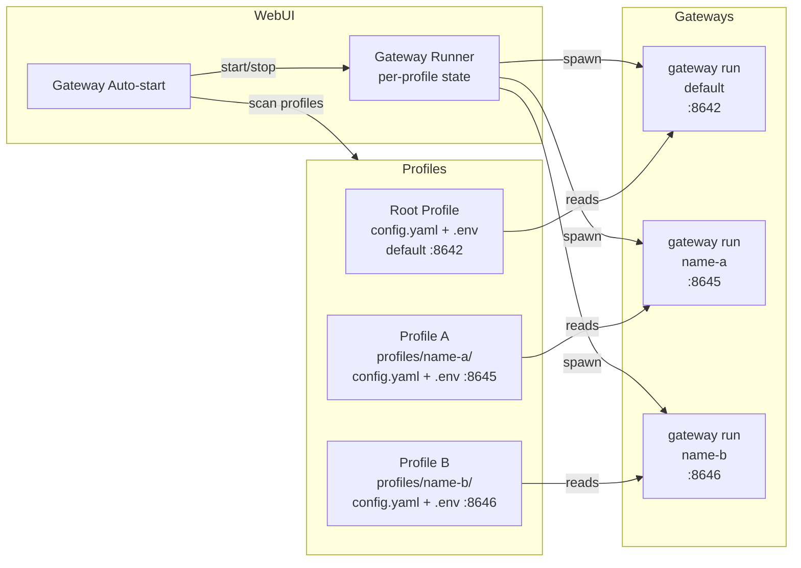
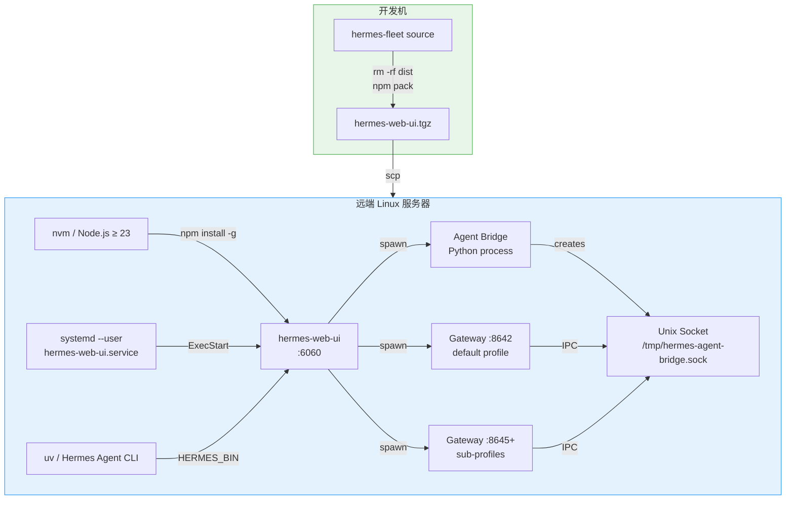

# Hermes Fleet 系统架构图

> Hermes Fleet v0.7.0 | 最后更新: 2026-07-07

## 架构概览

点击查看 Mermaid 源码

```mermaid
graph TB
    subgraph Browser["🖥️ Browser"]
        UI["Vue 3 Client<br/>SPA + Socket.IO"]
        UI --> ChatView["Chat View"]
        UI --> SettingsView["Settings / Profiles / Channels"]
        UI --> ToolsView["Terminal / Files / Kanban<br/>Coding Agents / Workflow"]
        UI --> AnalyticsView["Usage / Performance<br/>Models / Skills / Plugins"]
    end

    subgraph WebUI["hermes-web-ui Server (Node.js / Koa)"]
        HTTP["HTTP REST API<br/>+ JWT Auth"]
        WS_IO["Socket.IO<br/>chat-run / terminal<br/>kanban / workflow"]
        StaticServer["Static File Server<br/>dist/client/"]

        subgraph CoreServices["Core Services"]
            AgentRunner["Agent Runner<br/>Claude Code / Codex<br/>Ekko Agent"]
            GlobalAgent["Global Agent Server"]
            WorkflowMgr["Workflow Manager"]
            LanPeer["LAN Peer Discovery<br/>mDNS + WebSocket"]
            AppUpdate["App Update Check"]
        end

        subgraph HermesIntegration["Hermes Integration Layer"]
            BridgeMgr["Agent Bridge Manager"]
            GatewayRunner["Gateway Runner<br/>per-profile"]
            SessionSync["Session Sync<br/>+ Deleter"]
            SkillInjector["Skill Injector"]
            MCPServer["MCP Auto-inject"]
            ModelCache["Model Catalog Cache"]
            WriteGate["Write Gate<br/>Approval Review"]
            PetdexMgr["Petdex Manager"]
            TTS_STT["TTS / STT Providers"]
        end
    end

    subgraph AgentBridge["Agent Bridge (Python)"]
        BridgePy["hermes_bridge.py"]
        BridgeSock["Unix Socket<br/>/tmp/hermes-agent-bridge.sock"]
        BridgePy --> BridgeSock
    end

    subgraph HermesAgent["Hermes Agent (Python)"]
        GatewayRun["gateway run<br/>per-profile"]
        AgentCore["Agent Core<br/>LLM / Tools / Memory"]
        CronEngine["Cron Engine"]
        SessionDB["Session DB<br/>SQLite"]
        ConfigYAML["config.yaml<br/>+ .env"]
    end

    subgraph ExternalPlatforms["External Platforms"]
        TG["Telegram"]
        DC["Discord"]
        WA["WhatsApp"]
        FS["Feishu / Lark"]
        WX["WeChat / WeCom"]
        Slack["Slack"]
        Matrix["Matrix"]
    end

    subgraph ExternalLLM["LLM Providers"]
        OpenAI["OpenAI / Codex"]
        Anthropic["Anthropic"]
        Nous["Nous Portal"]
        Groq["Groq"]
        Custom["OpenAI-compatible<br/>Custom Providers"]
    end

    subgraph DataLayer["Data Layer"]
        AuthJSON["~/.hermes/auth.json<br/>Credentials"]
        EnvFile[".env<br/>per-profile"]
        SkillsDir["~/.hermes/skills/"]
        PluginDir["~/.hermes/plugins/"]
        HermesHome["~/.hermes/<br/>profiles/"]
    end

    Browser -->|"HTTP :6060"| WebUI
    StaticServer -->|"SPA"| Browser

    ChatView -->|"Socket.IO<br/>chat-run"| WS_IO
    ToolsView -->|"Socket.IO<br/>terminal/kanban/workflow"| WS_IO

    HTTP --> CoreServices
    WS_IO --> CoreServices

    AgentRunner -->|"spawn"| GatewayRun
    BridgeMgr -->|"spawn Python"| BridgePy
    BridgeSock -->|"IPC"| AgentCore
    BridgeMgr -->|"socket connect"| BridgeSock
    GatewayRunner -->|"spawn<br/>hermes gateway run"| GatewayRun
    GatewayRun --> AgentCore
    SessionSync --> SessionDB
    WriteGate -->|"approve"| AgentCore
    SkillInjector --> SkillsDir
    MCPServer --> AgentCore
    ModelCache -->|"GET /v1/models"| ExternalLLM

    AgentCore -->|"streaming"| GatewayRun
    GatewayRun -->|"messages"| ExternalPlatforms
    CronEngine -->|"scheduled"| AgentCore

    AgentCore -->|"read/write"| HermesHome
    AgentCore -->|"read"| AuthJSON
    AgentCore -->|"read"| EnvFile
    AgentCore -->|"read"| SkillsDir
    AgentCore -->|"read"| PluginDir
```

## 数据流图

点击查看 Mermaid 源码

```mermaid
sequenceDiagram
    actor User
    participant Browser as Vue Client
    participant Server as Koa Server
    participant Bridge as Agent Bridge
    participant Gateway as Hermes Gateway
    participant LLM as LLM Provider

    Note over User,LLM: 聊天会话数据流

    User->>Browser: 发送消息
    Browser->>Server: Socket.IO /chat-run
    Server->>Bridge: Unix Socket (IPC)
    Bridge->>Gateway: Python subprocess
    Gateway->>LLM: OpenAI-compatible API
    LLM-->>Gateway: streaming response
    Gateway-->>Bridge: tool calls + text
    Bridge-->>Server: IPC response
    Server-->>Browser: Socket.IO streaming
    Browser-->>User: 渲染 Markdown + 工具调用

    Note over User,LLM: Gateway → 外部平台消息流

    LLM-->>Gateway: response
    Gateway->>LLM: notify platform
    LLM-->>User: 平台推送消息
```

## Profile 与 Gateway 管理架构

点击查看 Mermaid 源码

```mermaid
graph LR
    subgraph WebUI
        direction TB
        AutoStart["Gateway Auto-start"]
        Runner["Gateway Runner\nper-profile state"]
    end

    subgraph Profiles
        direction TB
        Root["Root Profile\nconfig.yaml + .env\ndefault :8642"]
        P1["Profile A\nprofiles/name-a/\nconfig.yaml + .env :8645"]
        P2["Profile B\nprofiles/name-b/\nconfig.yaml + .env :8646"]
    end

    subgraph Gateways
        direction TB
        GW0["gateway run\ndefault\n:8642"]
        GW1["gateway run\nname-a\n:8645"]
        GW2["gateway run\nname-b\n:8646"]
    end

    AutoStart -->|"scan profiles"| Profiles
    AutoStart -->|"start/stop"| Runner
    Runner -->|"spawn"| GW0
    Runner -->|"spawn"| GW1
    Runner -->|"spawn"| GW2
    Root -->|"reads"| GW0
    P1 -->|"reads"| GW1
    P2 -->|"reads"| GW2
```

## 部署架构

点击查看 Mermaid 源码

```mermaid
graph TB
    subgraph DevMachine["开发机"]
        Source["hermes-fleet source"]
        Source -->|"rm -rf dist<br/>npm pack"| TGZ["hermes-web-ui.tgz"]
    end

    subgraph Server["远端 Linux 服务器"]
        NVM["nvm / Node.js ≥ 23"]
        UV["uv / Hermes Agent CLI"]
        Systemd["systemd --user<br/>hermes-web-ui.service"]
        WebUI["hermes-web-ui<br/>:6060"]
        GW_Default["Gateway :8642<br/>default profile"]
        GW_Profiles["Gateway :8645+<br/>sub-profiles"]
        BridgeProc["Agent Bridge<br/>Python process"]
        Socket["Unix Socket<br/>/tmp/hermes-agent-bridge.sock"]
    end

    TGZ -->|"scp"| Server
    NVM -->|"npm install -g"| WebUI
    Systemd -->|"ExecStart"| WebUI
    UV -->|"HERMES_BIN"| WebUI
    WebUI -->|"spawn"| GW_Default
    WebUI -->|"spawn"| GW_Profiles
    WebUI -->|"spawn"| BridgeProc
    BridgeProc -->|"creates"| Socket
    GW_Default -->|"IPC"| Socket
    GW_Profiles -->|"IPC"| Socket

    style DevMachine fill:#e8f5e9,stroke:#4caf50
    style Server fill:#e3f2fd,stroke:#2196f3
```

